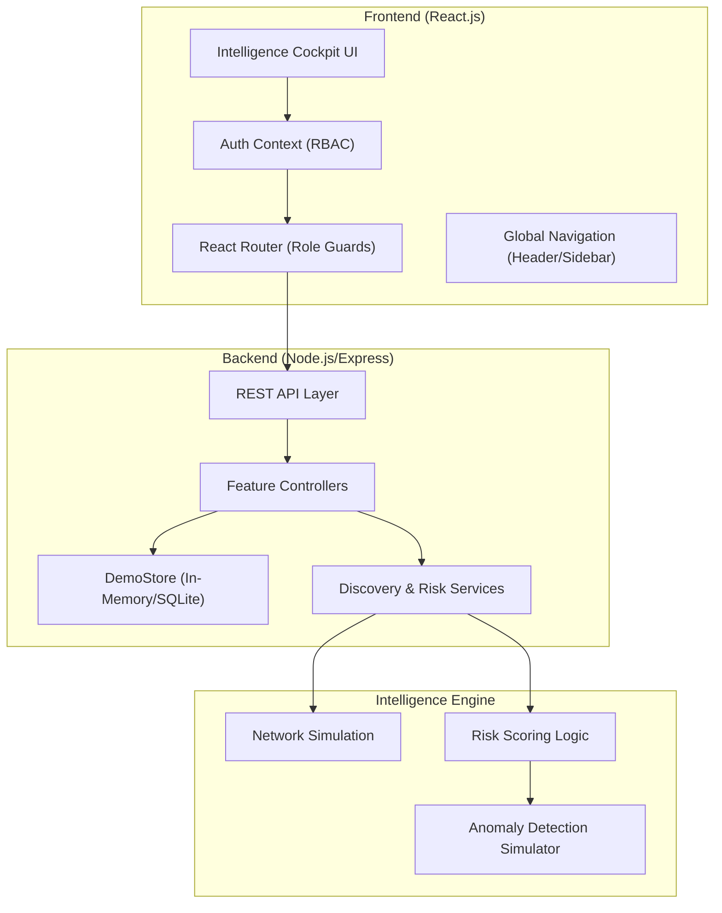
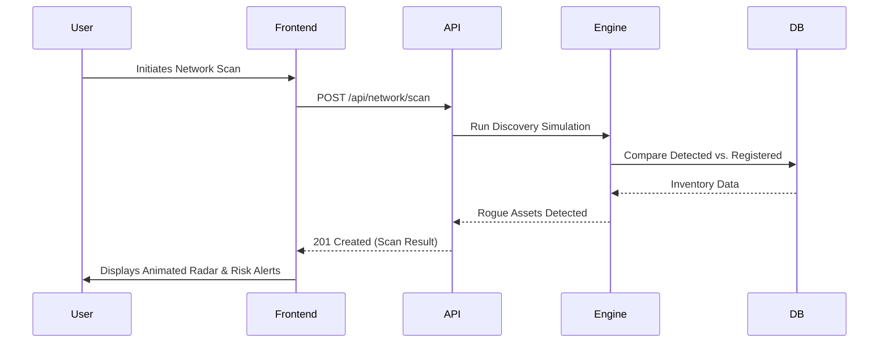

# 🏗️ CyberBase Intelligence Cockpit: Architecture Overview

This document provides a comprehensive breakdown of the technical architecture, component interactions, and visual hierarchy of the CyberBase security governance platform.

---

## 1. High-Level System Architecture

CyberBase follows a **Client-Server-Intelligence** pattern, optimized for real-time telemetry simulation and role-based decision support.

---

## 2. Core Components & Interactions

### 🔐 Multi-Tier RBAC Flow
The platform enforces strict Role-Based Access Control (RBAC) across three operational tiers:
1.  **CEO (Executive)**: Interacts with the `Maturity Scorecard` and `Strategic Recommendations`.
2.  **IT Manager (Operational)**: Controls `Network Scans`, `Asset Inventory`, and `Risk Mitigation`.
3.  **Employee (Awareness)**: Engages with the `Gamified Academy` and `Security Chatbot`.

### 🛰️ Asset Discovery Loop (Mismatch Matrix)
The "Shadow-IT" detection logic operates through a synchronized data flow:
*   **Trigger**: Manager initiates `networkAPI.scan()`.
*   **Logic**: Backend simulates ARP/SNMP discovery and compares it against the `Store` inventory.
*   **Output**: Discrepancies are flagged as **Rogue Devices** and automatically injected into the `Risk Matrix`.

### 🧠 Anomaly Intelligence Pipeline
Assets are processed through an asynchronous scoring service that evaluates:
*   **Contextual Rarity**: Comparing asset types against global organizational baselines.
*   **Behavioral Drift**: Identifying deviations in criticality and ownership.
*   **System Integrity**: Checking for update staleness and unauthorized configuration shifts.

---

## 3. Frontend Architecture (Design System)

The UI is built on a **Modular Glassmorphism** design system, ensuring a premium "Command Center" feel.

| Layer | Technology | Purpose |
|---|---|---|
| **Structure** | React.js | Component-based architecture. |
| **Animation** | Framer Motion | Fluid transitions and telemetry pulses. |
| **Visualization** | Recharts | Interactive risk and maturity telemetry. |
| **Theme** | Vanilla CSS | Custom "Cyber Blue" (`#0f172a`) design system. |
| **Utilities** | Lucide-inspired SVGs | Centralized `Icons.js` and `navigation.js`. |

---

## 4. Component Interaction Diagram

---

## 5. Visual Hierarchy

1.  **Level 0: Global Scaffold**: Persistent Sidebar (Navigation) and Header (Search, Notifications, Profile).
2.  **Level 1: Intelligence Hub**: Primary page content (KPIs, Charts, High-level metrics).
3.  **Level 2: Detail Terminal**: Modals and slide-overs for granular asset/risk data.
4.  **Level 3: Awareness Layer**: Gamified overlays and chatbot interfaces for interactive learning.
The system has four logical layers that map directly to the intelligence architecture: raw data inputs that feed into scoring engines, which power the AI knowledge base, which finally surfaces as role-gated views. Understanding each layer and how data moves between them explains why the platform behaves the way it does.
8.1  Layer 1 — Data inputs
Everything in the platform originates from four sources. The asset inventory is a list of 20 pre-seeded devices covering every role in a real company network: servers, firewalls, routers, workstations, laptops, printers, IoT cameras, and one deliberately unregistered legacy file server running Windows Server 2008. That last one is not an accident — it exists to make the anomaly detector fire immediately in any demo. The employee survey is eight multiple-choice questions about everyday security habits; employees submit their answers, and those answers become the raw material for the risk scorer. The network scan is a simulated Nmap call that returns a realistic discovery result every time the manager presses the button. The risk register holds entries from two sources: risks the manager enters manually, and risks the system creates automatically when a scan finds a rogue device with a dangerous open port.
8.2  Layer 2 — Scoring and detection engines
Three engines sit between the raw inputs and the user interface. They do the actual analytical work, and they are where the intelligence lives.
Asset anomaly detector. This is the Isolation-Forest-adjacent scoring engine in anomalyDetection.service.js. It first builds a baseline of what “normal” looks like for this specific organization: the most common asset type, the most common owner, the average number of days since an asset was last seen, and the ratio of unregistered to registered assets. It then scores every individual asset against that baseline across five weighted dimensions. Type rarity (weight 18) measures how unusual the asset’s category is within the organization — a single IoT camera in a company full of workstations scores higher here than it would in a company that runs IoT everywhere. Criticality shift (weight 22) flags mismatches between an asset’s type and its stated importance, for example a camera marked critical or a database marked low. Owner outlier (weight 14) checks whether the person or team listed as responsible owns any other assets, since an asset owned by someone who owns nothing else is harder to account for. Shadow IT penalty (weight 28) is the single strongest signal: an asset where the registered field is false gets a full penalty score of 1.0 on this dimension regardless of everything else. Staleness (weight 18) computes a z-score for the asset’s last-seen date against the organization mean, capped at three standard deviations. The five weighted scores are summed and normalized to a 0–100 range. Any asset scoring above 60 is flagged, and the engine writes a list of plain-English reasons explaining exactly why.
Shadow IT detector. The network scan engine in networkScan.service.js simulates what a real Nmap discovery run would return on a local area network. It takes the list of registered assets from the store, keeps roughly 85 percent of them in the result (the rest appear offline), and then injects two to four rogue devices — devices that exist on the network but are not in the inventory. The core equation the UI surfaces is: detected minus registered equals rogue. Every rogue device is assigned a realistic IP, MAC address, hostname, operating system, and a set of open ports drawn from a curated list of dangerous services: RDP on 3389, Telnet on 23, FTP on 21, SMB on 445, VNC on 5900, and SSH on 22. The engine deliberately ensures that at least one rogue device exposes a critical-severity port so the demo always produces a meaningful alert. When the controller processes the scan result, it iterates over rogue devices with critical ports and automatically creates a risk entry in the register for each one, with no further action required from the manager.
Employee risk scorer. The risk scoring engine in riskScoring.service.js holds the eight survey questions and evaluates each answer against a hidden weight table. Safe answers carry zero weight. Risky answers accumulate points: 30 for clicking a suspicious link, 30 for always reusing passwords, 35 for plugging in an unknown USB, 35 for having shared a password before, 25 for ignoring software updates, 25 for having no two-factor authentication, 28 for regularly using public Wi-Fi without a VPN, and 40 for wiring money in response to a fake CEO email — the highest single weight, reflecting how financially devastating business email compromise attacks are in practice. The raw sum is divided by 248 (the maximum possible score if every worst answer is selected) and multiplied by 100. Separately, certain answers push a red-flag string into the result: a concrete behavioral concern like “reuses passwords across services” or “vulnerable to CEO/BEC fraud.” An employee is marked suspicious if their normalized score reaches 60 or above, or if they accumulate three or more red flags, whichever comes first. The second condition catches employees who answered most questions sensibly but admitted to a small number of extremely dangerous habits.
8.3  Layer 3 — AI knowledge base
The AI knowledge base in aiKnowledge.service.js provides two distinct conversational assistants powered by a rule-based keyword engine. Both assistants return the same structured response shape — an answer string, a severity level, a list of concrete recommendations, and a list of source citations — which the frontend renders identically regardless of which assistant produced it. This makes the interface already compatible with a real language model: the only change needed to plug in Anthropic Claude, Groq, or Gemini is replacing the function body, not any UI code.
The IT Copilot is built for the IT manager and covers the exact topics that appear in a real network scan alert. It contains detailed intel on six dangerous port numbers — 3389 RDP, 23 Telnet, 21 FTP, 445 SMB, 5900 VNC, and 22 SSH — and can also handle topic-based questions about ransomware, rogue devices, phishing defense, VPN configuration, patch management, multi-factor authentication, firewall policy, and backup strategy. Each answer is calibrated to its severity: RDP exposure is critical, an unpatched system is high, SSH on the internet is medium. The recommendations in every answer are sourced from CISA advisories, NIST Special Publications, and the CIS Controls framework, and those sources are cited in the response so the manager can hand them to a vendor or a CEO when requesting budget.
The Employee Chatbot is built for employees and covers the everyday scenarios in which most real breaches start: recognizing phishing, handling suspicious email attachments, safe password and two-factor authentication practices, what to do with an unknown USB stick, public Wi-Fi risks, CEO fraud and business email compromise, and — critically — the “I already clicked something bad, what now?” scenario. The tone is deliberately reassuring. Employees should feel safe asking questions that they might consider embarrassing, because the alternative is silence, and silence is how a phishing click goes unreported for three days while an attacker escalates through the network.
8.4  Layer 4 — Role-gated views and the feedback loop
The three role views are not simply different menus on the same data. They are deliberately scoped to what each person actually needs to act. The CEO view is read-only and jargon-free: a maturity score, a count of shadow IT devices and AI-flagged anomalies, the top three flagged assets with plain-English reasons, a risk distribution chart, and a list of auto-generated recommendations. Every number on the CEO dashboard has a tooltip showing the formula used to compute it. The CEO is not expected to trust the system blindly, and the transparency layer makes it possible for a non-technical executive to interrogate the logic if they choose to.
The IT manager view is operational. It exposes full CRUD on assets and risks, the network scan interface with the mismatch equation displayed prominently, a drill-down anomaly intelligence page showing the five-dimension breakdown for each flagged asset, the assessment review page listing every employee’s score and red flags, and the AI Copilot chat window. The manager is the only role that can trigger side effects: running a scan, creating a risk, or updating an asset all change the data that the CEO’s dashboard reads on the next load.
