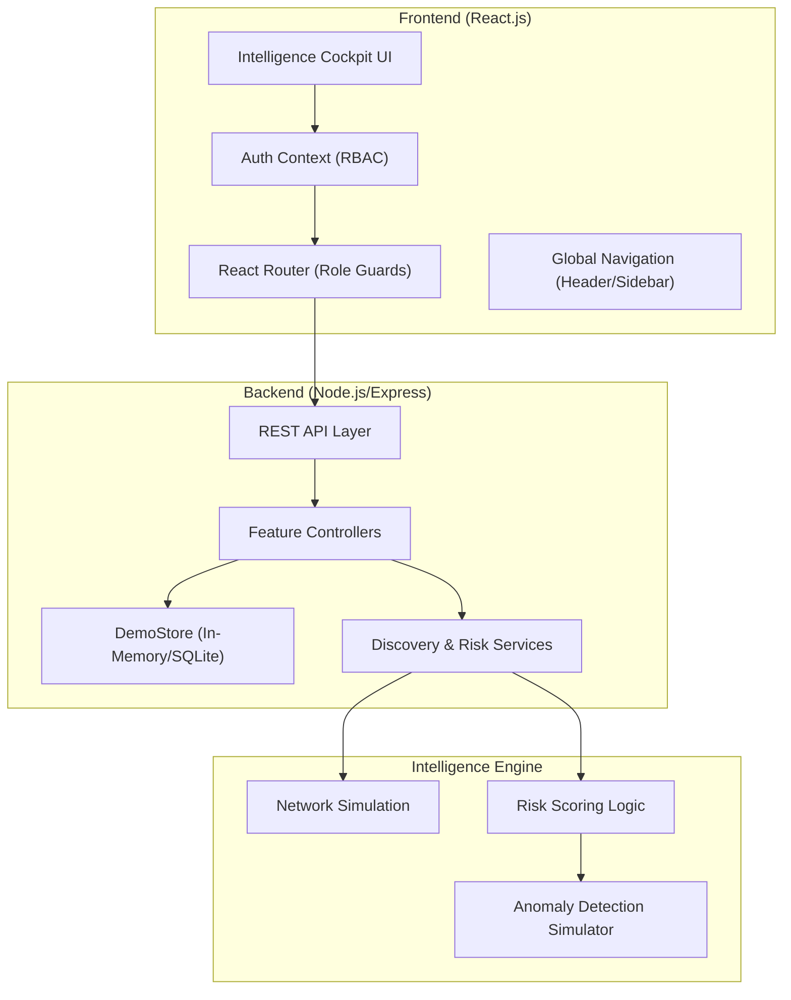
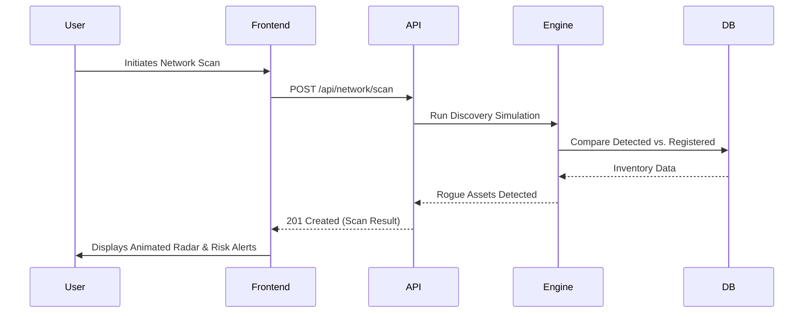

# 🏗️ CyberBase Intelligence Cockpit: Architecture Overview

This document provides a comprehensive breakdown of the technical architecture, component interactions, and visual hierarchy of the CyberBase security governance platform.

---

## 1. High-Level System Architecture

CyberBase follows a **Client-Server-Intelligence** pattern, optimized for real-time telemetry simulation and role-based decision support.

---

## 2. Core Components & Interactions

### 🔐 Multi-Tier RBAC Flow
The platform enforces strict Role-Based Access Control (RBAC) across three operational tiers:
1.  **CEO (Executive)**: Interacts with the `Maturity Scorecard` and `Strategic Recommendations`.
2.  **IT Manager (Operational)**: Controls `Network Scans`, `Asset Inventory`, and `Risk Mitigation`.
3.  **Employee (Awareness)**: Engages with the `Gamified Academy` and `Security Chatbot`.

### 🛰️ Asset Discovery Loop (Mismatch Matrix)
The "Shadow-IT" detection logic operates through a synchronized data flow:
*   **Trigger**: Manager initiates `networkAPI.scan()`.
*   **Logic**: Backend simulates ARP/SNMP discovery and compares it against the `Store` inventory.
*   **Output**: Discrepancies are flagged as **Rogue Devices** and automatically injected into the `Risk Matrix`.

### 🧠 Anomaly Intelligence Pipeline
Assets are processed through an asynchronous scoring service that evaluates:
*   **Contextual Rarity**: Comparing asset types against global organizational baselines.
*   **Behavioral Drift**: Identifying deviations in criticality and ownership.
*   **System Integrity**: Checking for update staleness and unauthorized configuration shifts.

---

## 3. Frontend Architecture (Design System)

The UI is built on a **Modular Glassmorphism** design system, ensuring a premium "Command Center" feel.

| Layer | Technology | Purpose |
|---|---|---|
| **Structure** | React.js | Component-based architecture. |
| **Animation** | Framer Motion | Fluid transitions and telemetry pulses. |
| **Visualization** | Recharts | Interactive risk and maturity telemetry. |
| **Theme** | Vanilla CSS | Custom "Cyber Blue" (`#0f172a`) design system. |
| **Utilities** | Lucide-inspired SVGs | Centralized `Icons.js` and `navigation.js`. |

---

## 4. Component Interaction Diagram

---

## 5. Visual Hierarchy

1.  **Level 0: Global Scaffold**: Persistent Sidebar (Navigation) and Header (Search, Notifications, Profile).
2.  **Level 1: Intelligence Hub**: Primary page content (KPIs, Charts, High-level metrics).
3.  **Level 2: Detail Terminal**: Modals and slide-overs for granular asset/risk data.
4.  **Level 3: Awareness Layer**: Gamified overlays and chatbot interfaces for interactive learning.
